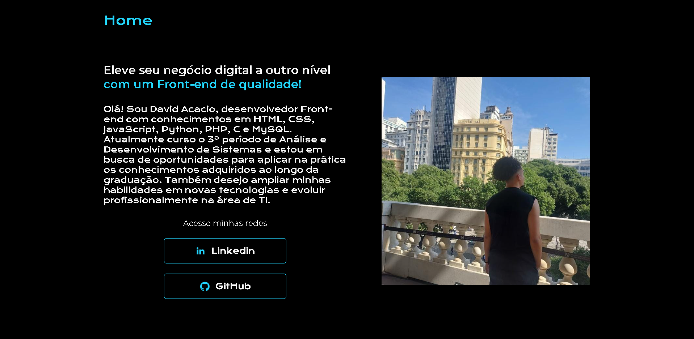

# Apresentação - David Acacio

## Sobre mim
Olá! Sou **David Acacio**, desenvolvedor Front-end com conhecimentos em **HTML, CSS, JavaScript, Python, PHP, C e MySQL**.  
Atualmente curso o **3º período de Análise e Desenvolvimento de Sistemas** e estou em busca de oportunidades para aplicar meus conhecimentos na prática, aprender novas tecnologias e evoluir profissionalmente na área de TI.  

## Tecnologias
- HTML  
- CSS  
- JavaScript  
- Python  
- PHP  
- C  
- MySQL  

## Acesse minhas redes
- [LinkedIn](https://www.linkedin.com/in/david-acacio-420177266/)  
- [GitHub](https://github.com/DavidAcacio)  

---

⭐ Projeto desenvolvido como parte do meu portfólio pessoal.
